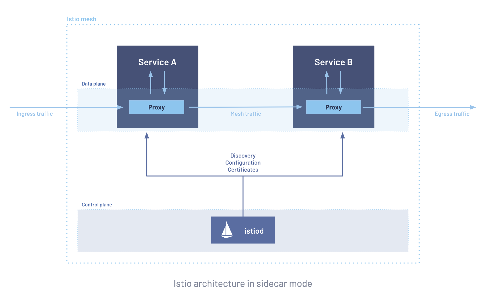
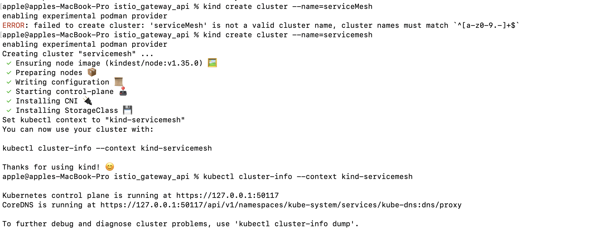
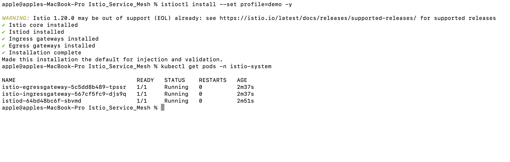
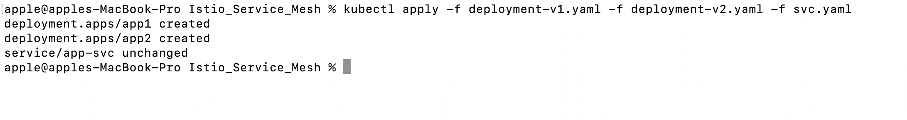
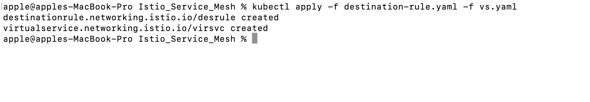
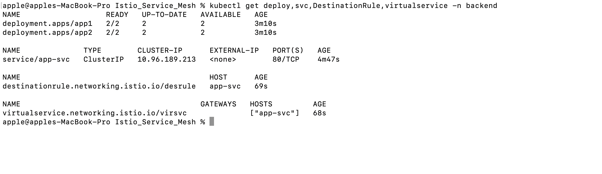
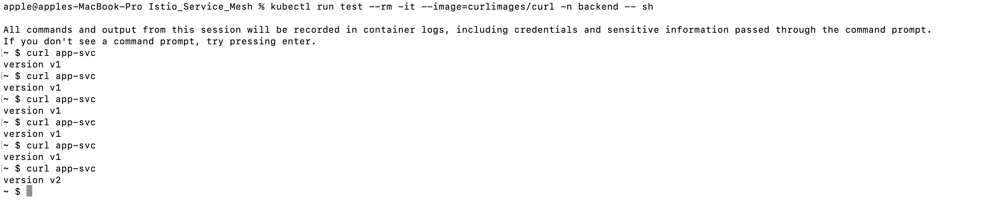
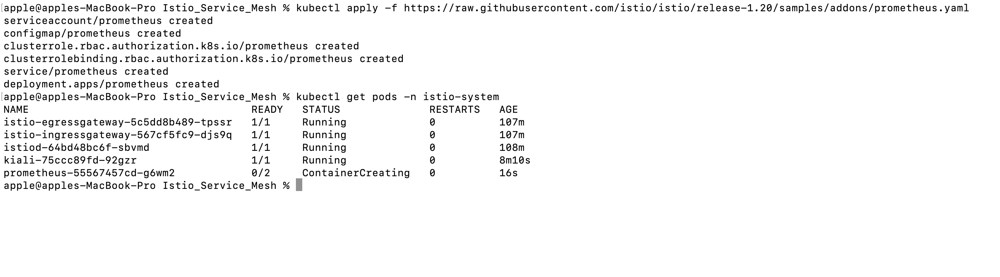
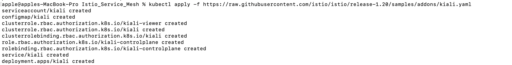
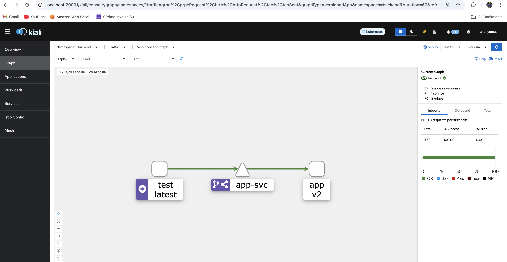

#Service MESH\
Phase 1 (done) (find in https://github.com/Shubham2194/kubernetes-CKA/tree/main/istio_gateway_api) \
Ingress Gateway\ + TLS\ + HTTPRoute

Phase 2 (your next POC)\
Service Mesh + Traffic Control

This means demonstrating:

1️⃣ Service Mesh (sidecars + mTLS)\
2️⃣ Canary deployment (traffic splitting)\
3️⃣ Blue/Green deployment\
4️⃣ Observability (Kiali graph)

Prerequisites:
- Podman (install from Official Website https://podman.io/docs/installation)\
- Kind (Install from Official website https://kind.sigs.k8s.io/docs/user/quick-start/#installation)


Step1 : Start Podman 

```
 podman machine start
```


Step 2: Run Kind cluster 

```
kind create cluster --name=serviceMesh
```


Verfify:
```
kubectl get nodes
```


Step 3 — Install Istio (we already have istio up and running)
```
curl -L https://istio.io/downloadIstio | ISTIO_VERSION=1.20.2 sh -
cd istio-1.20.2
export PATH=$PWD/bin:$PATH
```

Install:
```
istioctl install --set profile=demo -y
```
Verify:
```
kubectl get pods -n istio-system
```



Step 4 — Enable Sidecar Injection

Create namespace:

```
apiVersion: v1
kind: Namespace
metadata:
  name: backend
  labels:
    istio-injection: enabled
```

Apply:

```
kubectl apply -f ns.yaml
```

Step 5 — Deploy Two Versions

Deployment v1
```
apiVersion: apps/v1
kind: Deployment
metadata:
  name: app1
  namespace: backend
spec:
  replicas: 2
  selector:
    matchLabels:
      app: app
      version: v1
  template:
    metadata:
      labels:
        app: app
        version: v1
    spec:
      containers:
      - name: app
        image: hashicorp/http-echo
        args:
        - "-text=version v1"
        ports:
        - containerPort: 5678
```

Deployment v2

```
apiVersion: apps/v1
kind: Deployment
metadata:
  name: app2
  namespace: backend
spec:
  replicas: 2
  selector:
    matchLabels:
      app: app
      version: v2
  template:
    metadata:
      labels:
        app: app
        version: v2
    spec:
      containers:
      - name: app
        image: hashicorp/http-echo
        args:
        - "-text=version v2"
        ports:
        - containerPort: 5678
```
Step 6 — Create Service

Both versions behind one service.
```
apiVersion: v1
kind: Service
metadata:
  name: app-svc
  namespace: backend
spec:
  selector:
    app: app
  ports:
  - port: 80
    targetPort: 5678
```


Step 7 — DestinationRule

Define subsets.

```
apiVersion: networking.istio.io/v1beta1
kind: DestinationRule
metadata:
  name: desrule
  namespace: backend
spec:
  host: app-svc
  subsets:
  - name: v1
    labels:
      version: v1
  - name: v2
    labels:
      version: v2
```


Step 8 — Canary Deployment

Traffic split.

```
apiVersion: networking.istio.io/v1beta1
kind: virsvc
metadata:
  name: 
  namespace: backend
spec:
  hosts:
  - app-svc
  http:
  - route:
    - destination:
        host: app-svc
        subset: v1
      weight: 90
    - destination:
        host: app-svc
        subset: v2
      weight: 10
```




```
kubectl get deploy,svc,DestinationRule,virtualservice -n backend
```



Result:

90% → v1\
10% → v2

Test:
```
kubectl run test --rm -it --image=curlimages/curl -n backend -- sh
```
Inside pod:

```
curl app-svc
````

You will see mix of:

version v1
version v2





Step 9 — Blue Green Deployment

Blue = v1
Green = v2

Switch traffic in virtual service: 
```
route:
- destination:
    host: app-svc
    subset: v2
  weight: 100
```
Now:

100% → v2

Rollback easy:

100% → v1


Step 10 — Enable mTLS (Service Mesh Security)
```
apiVersion: security.istio.io/v1beta1
kind: PeerAuthentication
metadata:
  name: default
  namespace: backend
spec:
  mtls:
    mode: STRICT
```
Now all traffic inside namespace is encrypted.

Step 11 - Install Prometheus (Kiali requires Prometheus to render the service mesh graph)

```
kubectl apply -f https://raw.githubusercontent.com/istio/istio/release-1.20/samples/addons/prometheus.yaml
```




Step 11 — Install Kiali

Kiali shows service mesh graph.

```
kubectl apply -f https://raw.githubusercontent.com/istio/istio/release-1.20/samples/addons/kiali.yaml
```



Open dashboard:

istioctl dashboard kiali

You will see:

demo-v1 → demo-v2
traffic percentages





What This POC Demonstrates

Your POC will prove:

1️⃣ Service Mesh\
Automatic sidecars + secure communication.

2️⃣ Canary Deployment\
Gradual rollout.

90% → v1\
10% → v2

3️⃣ Blue/Green\
Instant switch between versions.

4️⃣ Zero Trust Security\
mTLS enabled.

5️⃣ Observability\
Kiali traffic graph.
