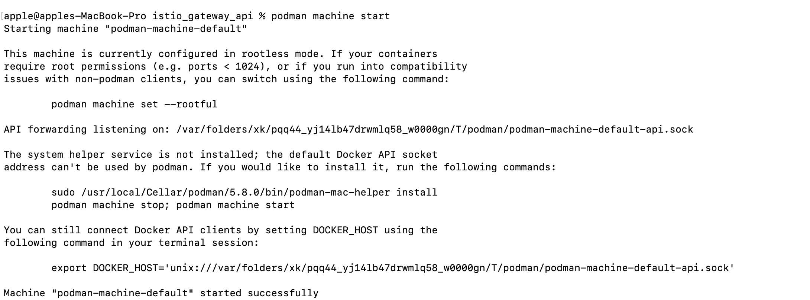

#Service MESH

I an doing this POC on Podman

Step1 : Start Podman (install from Official Website https://podman.io/docs/installation)

```
 podman machine start
```



Step 2: Run Kind cluster (Install from Official website https://kind.sigs.k8s.io/docs/user/quick-start/#installation)

kind create cluster --name=serviceMesh

