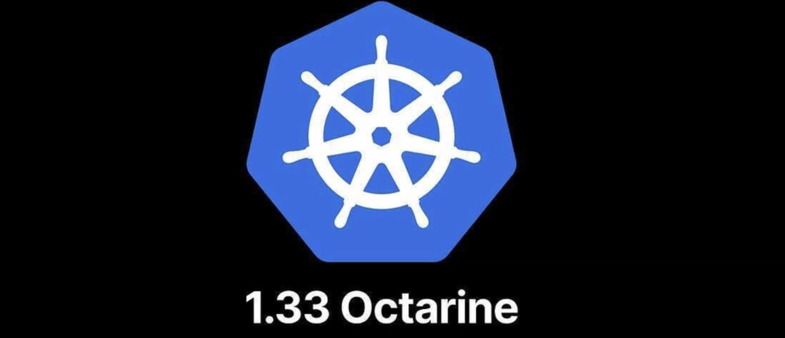

# EKS Cluster Upgrade Guide — Zero Downtime (1.32 → 1.33)

> A production-tested, step-by-step guide to upgrading an Amazon EKS cluster with zero downtime.  
> Covers prerequisites, version checks, Terraform config, addon migration, and post-upgrade cleanup.

---

## Table of Contents

- [Architecture Overview](#architecture-overview)
- [Prerequisites](#prerequisites)
- [Step 1 — Check Current Versions](#step-1--check-current-versions)
- [Step 2 — Check Compatible Target Versions](#step-2--check-compatible-target-versions)
- [Step 3 — Terraform Configuration](#step-3--terraform-configuration)
- [Step 4 — Apply Sequence](#step-4--apply-sequence)
- [Step 5 — Post-Upgrade Verification](#step-5--post-upgrade-verification)
- [Step 6 — Revert Temporary Changes](#step-6--revert-temporary-changes)
- [Important Gotchas](#important-gotchas)
- [Release Notes Reference](#release-notes-reference)

---

## Architecture Overview

This guide applies to clusters with:

- EKS managed node groups (x86 + Graviton/ARM64)
- Self-managed addons (vpc-cni, kube-proxy, coredns) migrating to EKS managed addons
- One EKS managed addon already in place (aws-ebs-csi-driver)
- Private endpoint only (`endpoint_public_access = false`)
- Amazon Linux 2023 (AL2023) — **not** AL2

---

## Prerequisites

Before starting the upgrade, verify all of the following:

| # | Check | Why |
|---|---|---|
| 1 | Read the release notes for your target version | Breaking API changes, deprecated features |
| 2 | Test the upgrade in a lower environment first | Catch workload-specific issues before prod |
| 3 | Control plane version must equal node version before upgrading | EKS enforces this — upgrade CP first, nodes second |
| 4 | Kubelet version must match control plane version | Version skew causes scheduling issues |
| 5 | At least 5 free IPs available in your control plane subnet | EKS needs headroom for managed node operations |
| 6 | Cordon nodes before upgrade (stops new scheduling during rollout) | Prevents pods landing on nodes mid-replacement |

### Check available IPs in your subnet

```bash
# Get subnet IDs from your node group
aws eks describe-nodegroup \
  --cluster-name <cluster-name> \
  --nodegroup-name <nodegroup-name> \
  --region ap-south-1 \
  --query "nodegroup.subnets"

# Check available IPs
aws ec2 describe-subnets \
  --subnet-ids <subnet-id> \
  --query "Subnets[*].{SubnetId:SubnetId,AvailableIPs:AvailableIpAddressCount}"
```

---

## Step 1 — Check Current Versions

Run this script to get a full picture of your cluster before touching anything.

### upgrade-check.sh

```bash
#!/bin/bash

CLUSTER_NAME="production-cluster"
REGION="ap-south-1"

echo "=== CONTROL PLANE ==="
aws eks describe-cluster \
  --name $CLUSTER_NAME \
  --region $REGION \
  --query "cluster.{Version:version,Status:status}" \
  --output table

echo ""
echo "=== NODES ==="
kubectl get nodes -o custom-columns=\
"NODE:.metadata.name,\
VERSION:.status.nodeInfo.kubeletVersion,\
STATUS:.status.conditions[-1].type,\
OS:.status.nodeInfo.osImage"

echo ""
echo "=== KUBELET VERSIONS ==="
kubectl get nodes -o jsonpath=\
'{range .items[*]}{.metadata.name}{"\t"}{.status.nodeInfo.kubeletVersion}{"\n"}{end}'

echo ""
echo "=== EKS MANAGED ADDONS ==="
aws eks list-addons --cluster-name $CLUSTER_NAME --region $REGION

echo ""
echo "=== SELF-MANAGED ADDON IMAGES ==="
echo "vpc-cni:    $(kubectl get ds aws-node -n kube-system \
  -o jsonpath='{.spec.template.spec.containers[0].image}')"
echo "kube-proxy: $(kubectl get ds kube-proxy -n kube-system \
  -o jsonpath='{.spec.template.spec.containers[0].image}')"
echo "coredns:    $(kubectl get deploy coredns -n kube-system \
  -o jsonpath='{.spec.template.spec.containers[0].image}')"

echo ""
echo "=== SUBNET AVAILABLE IPs ==="
SUBNET_IDS=$(aws eks describe-nodegroup \
  --cluster-name $CLUSTER_NAME \
  --nodegroup-name $CLUSTER_NAME-node-group \
  --region $REGION \
  --query "nodegroup.subnets" \
  --output text)

aws ec2 describe-subnets \
  --subnet-ids $SUBNET_IDS \
  --region $REGION \
  --query "Subnets[*].{SubnetId:SubnetId,AvailableIPs:AvailableIpAddressCount}" \
  --output table
```


---

## Step 2 — Check Compatible Target Versions

Always fetch the real-time compatible addon versions from AWS before hardcoding in tfvars.  
Never assume — addon versions change with each EKS release.

### check-compatible-versions.sh

```bash
#!/bin/bash

CLUSTER_VER="1.33"
REGION="ap-south-1"

for addon in kube-proxy vpc-cni coredns aws-ebs-csi-driver; do
  echo "=== $addon ==="
  aws eks describe-addon-versions \
    --kubernetes-version "$CLUSTER_VER" \
    --addon-name "$addon" \
    --region "$REGION" \
    --query "addons[0].addonVersions[?compatibilities[0].defaultVersion==\`true\`].addonVersion" \
    --output text
done
```

> **Note:** The backtick escaping (`\`true\``) is required when using double-quoted `--query` strings in bash.

### Expected output for 1.33 (as of this writing)

```
=== kube-proxy ===
v1.33.3-eksbuild.4
=== vpc-cni ===
v1.20.4-eksbuild.2
=== coredns ===
v1.12.1-eksbuild.2
=== aws-ebs-csi-driver ===
v1.56.0-eksbuild.1
```

---

## Step 3 — Terraform Configuration

### 3a. Check for custom vpc-cni config before applying

If you have customised the `aws-node` DaemonSet (MTU, log levels, IP targets), those values will be **wiped** by `OVERWRITE` unless you preserve them in Terraform.

```bash
# Check current vpc-cni env vars
kubectl get daemonset aws-node -n kube-system \
  -o jsonpath='{.spec.template.spec.containers[0].env}' | jq .

# Check CoreDNS ConfigMap for custom DNS rules
kubectl get configmap coredns -n kube-system -o yaml
```

Key non-default values to watch for:

| Env Var | Default | Common Custom Value | Impact if reset |
|---|---|---|---|
| `AWS_VPC_ENI_MTU` | `1500` | `9001` (Jumbo frames) | Silent packet fragmentation |
| `AWS_VPC_K8S_CNI_LOGLEVEL` | `ERROR` | `DEBUG` | Log verbosity change |
| `WARM_PREFIX_TARGET` | `0` | `1` | IP pre-allocation behaviour |
| `ENABLE_PREFIX_DELEGATION` | `false` | `true` | Pod density change |

### 3b. eks/main.tf

```hcl
resource "aws_eks_cluster" "cluster" {
  name     = var.cluster_name
  role_arn = var.cluster_iam_role_arn
  version  = var.cluster_version          # bumped to "1.33" in tfvars

  vpc_config {
    subnet_ids              = var.private_subnet_ids
    endpoint_private_access = true
    endpoint_public_access  = false
  }
}

# x86 node group
resource "aws_eks_node_group" "node_group" {
  cluster_name    = aws_eks_cluster.cluster.name
  node_group_name = "${var.cluster_name}-node-group"
  node_role_arn   = var.node_iam_role_arn
  subnet_ids      = var.private_subnet_ids
  version         = "1.33"

  scaling_config {
    desired_size = 1
    max_size     = 2    # temporarily bumped from 1 → allows surge node
    min_size     = 1
  }

  update_config {
    max_unavailable = 1
  }

  instance_types = var.instance_types
  disk_size      = 30
}

# Graviton node group
resource "aws_eks_node_group" "node_group_graviton" {
  cluster_name    = aws_eks_cluster.cluster.name
  node_group_name = "${var.cluster_name}-node-group-graviton"
  node_role_arn   = var.node_iam_role_arn
  subnet_ids      = var.private_subnet_ids
  version         = "1.33"
  ami_type        = "AL2023_ARM_64_STANDARD"

  scaling_config {
    desired_size = 3
    max_size     = 4    # temporarily bumped from 3 → allows 1 surge node
    min_size     = 3
  }

  update_config {
    max_unavailable = 1
  }

  taint {
    key    = "arch"
    value  = "arm64"
    effect = "NO_SCHEDULE"
  }

  labels = {
    name = "graviton"
    arch = "arm64"
    role = "compute"
  }
}

```

### 3c. addons/main.tf

```hcl
resource "aws_eks_addon" "vpc_cni" {
  cluster_name                = var.cluster_name
  addon_name                  = "vpc-cni"
  addon_version               = var.vpc_cni_version
  resolve_conflicts_on_update = "OVERWRITE"

  # Preserve non-default values — OVERWRITE will reset these otherwise
  configuration_values = jsonencode({
    env = {
      AWS_VPC_ENI_MTU              = "9001"   # Jumbo frames — critical for performance
      AWS_VPC_K8S_CNI_LOGLEVEL     = "DEBUG"
      AWS_VPC_K8S_PLUGIN_LOG_LEVEL = "DEBUG"
      WARM_PREFIX_TARGET           = "1"
    }
  })
}

resource "aws_eks_addon" "coredns" {
  cluster_name                = var.cluster_name
  addon_name                  = "coredns"
  addon_version               = var.core_dns_version
  resolve_conflicts_on_update = "OVERWRITE"
}

resource "aws_eks_addon" "kube_proxy" {
  cluster_name                = var.cluster_name
  addon_name                  = "kube-proxy"
  addon_version               = var.kube_proxy_version
  resolve_conflicts_on_update = "OVERWRITE"
}

resource "aws_eks_addon" "ebs_csi_driver" {
  cluster_name                = var.cluster_name
  addon_name                  = "aws-ebs-csi-driver"
  addon_version               = var.ebs_csi_version
  service_account_role_arn    = var.ebs_csi_role_arn
  resolve_conflicts_on_update = "OVERWRITE"
}
```

### 3d. terraform-prod.tfvars

```hcl
region          = "ap-south-1"
cluster_name    = "production-cluster"
cluster_version = "1.33"

kube_proxy_version = "v1.33.3-eksbuild.4"   # must match cluster version
vpc_cni_version    = "v1.20.4-eksbuild.2"
core_dns_version   = "v1.12.1-eksbuild.2"
ebs_csi_version    = "v1.56.0-eksbuild.1"
```

> Always run `check-compatible-versions.sh` above before setting these values.  
> `kube_proxy_version` **must** match the cluster version major.minor — using a 1.32 kube-proxy on a 1.33 cluster will cause issues.

---

## Step 4 — Apply Sequence

**Order is mandatory.** Control plane → nodes → addons. Never apply all at once.

```bash
# ── STEP 1: Upgrade control plane ─────────────────────
terraform apply -target=aws_eks_cluster.cluster

# Wait until ACTIVE on 1.33 — do not proceed until this shows Version: 1.33
aws eks describe-cluster \
  --name production-cluster \
  --region ap-south-1 \
  --query "cluster.{Version:version,Status:status}"


# ── STEP 2: Upgrade node groups ────────────────────────
# One at a time — safer, easier to debug if something goes wrong
terraform apply -target=aws_eks_node_group.node_group
terraform apply -target=aws_eks_node_group.node_group_graviton

# Verify all nodes are on 1.33 before touching addons
kubectl get nodes -o custom-columns=\
"NODE:.metadata.name,\
VERSION:.status.nodeInfo.kubeletVersion,\
STATUS:.status.conditions[-1].type"


# ── STEP 3: Upgrade addons ─────────────────────────────
# Order: kube-proxy → vpc-cni → coredns → ebs-csi
# coredns last — keeps DNS resolution stable throughout
terraform apply -target=aws_eks_addon.kube_proxy
terraform apply -target=aws_eks_addon.vpc_cni
terraform apply -target=aws_eks_addon.coredns
terraform apply -target=aws_eks_addon.ebs_csi_driver
```

---

## Step 5 — Post-Upgrade Verification

```bash
# Control plane version
aws eks describe-cluster \
  --name production-cluster \
  --region ap-south-1 \
  --query "cluster.{Version:version,Status:status}"

# All nodes healthy on 1.33
kubectl get nodes

# All kube-system pods running
kubectl get pods -n kube-system

# All addons now EKS managed
aws eks list-addons \
  --cluster-name production-cluster \
  --region ap-south-1

# Verify addon versions
for addon in kube-proxy vpc-cni coredns aws-ebs-csi-driver; do
  echo "=== $addon ==="
  aws eks describe-addon \
    --cluster-name production-cluster \
    --addon-name $addon \
    --region ap-south-1 \
    --query "addon.{Version:addonVersion,Status:status}" \
    --output table
done

# Verify vpc-cni preserved custom config
kubectl get daemonset aws-node -n kube-system \
  -o jsonpath='{.spec.template.spec.containers[0].env}' | jq .
```

---

## Step 6 — Revert Temporary Changes

After the upgrade is verified healthy, revert the temporary `max_size` bumps.

```hcl
# eks/main.tf — revert max_size on all 3 node groups
# node_group                → max_size = 1  (was 2)
# node_group_graviton       → max_size = 3  (was 4)
# node_group_graviton_internal → max_size = 1  (was 2)
```

```bash
terraform apply -target=aws_eks_node_group.node_group
terraform apply -target=aws_eks_node_group.node_group_graviton
```

> Leaving `max_size` elevated is harmless but creates unused headroom that could allow unexpected scale-out from autoscalers or manual actions.

---

## Important Gotchas

### 1. Self-managed vs EKS managed addons

If you created your cluster via Terraform (not AWS Console/eksctl), vpc-cni, kube-proxy, and coredns are installed as **self-managed** DaemonSets/Deployments — not visible via `aws eks list-addons`. The `aws_eks_addon` Terraform resource will adopt and migrate them to managed addons on first apply. This is expected behaviour.

### 2. kube-proxy version must match cluster version

`kube-proxy` is the one addon where the version major.minor **must** match your cluster. A 1.32 kube-proxy on a 1.33 cluster causes networking issues. All other addons have more flexibility.

### 3. OVERWRITE wipes custom vpc-cni config

`resolve_conflicts_on_update = "OVERWRITE"` is needed to adopt self-managed addons, but it resets any customisations. Always check your current `aws-node` DaemonSet env vars and preserve non-defaults in `configuration_values` in Terraform before applying.

### 4. Single-node groups need max_size headroom for zero downtime

EKS upgrades node groups by launching a new node first, then draining the old one. If `max_size = desired_size`, EKS cannot surge and must drain before replacing — creating a brief gap. Temporarily set `max_size = desired_size + 1` during the upgrade window.

### 5. update_strategy = "rolling update" is invalid Terraform

The `update_config` block does not accept `update_strategy`. Use `max_unavailable` or `max_unavailable_percentage` instead.

```hcl
# ❌ Invalid
update_config {
  update_strategy = "rolling update"
}

# ✅ Correct
update_config {
  max_unavailable = 1
}
```

### 6. Apply control plane and nodes separately — never together

Applying everything at once risks nodes upgrading before the control plane is ready, which EKS will reject. Always wait for `Status: ACTIVE` on the control plane before proceeding to node groups.

### 7. CoreDNS last — always

Upgrading CoreDNS restarts the DNS pods. Doing it last means all other components are already on the new version and stable before DNS is touched. Upgrading it early risks DNS resolution gaps during the rollout window.

---

## Release Notes Reference

Always review these before any upgrade:

| Source | URL | What to check |
|---|---|---|
| EKS version guide | `docs.aws.amazon.com/eks/latest/userguide/kubernetes-versions-standard.html` | EKS-specific changes, addon compatibility |
| Kubernetes changelog | `github.com/kubernetes/kubernetes/blob/master/CHANGELOG/CHANGELOG-1.33.md` | Removed APIs, breaking changes |
| AWS What's New | `aws.amazon.com/about-aws/whats-new` → search "EKS 1.33" | Official AWS announcement |
| EKS AMI changelog | `awslabs.github.io/amazon-eks-ami/CHANGELOG` | Node AMI and runtime changes |

---

## Summary — What Changes After This Upgrade

| Component | Before | After |
|---|---|---|
| Control plane | 1.32 | 1.33 |
| All nodes | v1.32.9 | v1.33.x |
| kube-proxy | v1.32.0 self-managed | v1.33.3 EKS managed |
| vpc-cni | v1.19.2 self-managed | v1.20.4 EKS managed |
| coredns | v1.11.4 self-managed | v1.12.1 EKS managed |
| ebs-csi-driver | v1.56.0 EKS managed | v1.56.0 EKS managed (no change) |

---

*Tested on: EKS production-cluster · ap-south-1 · AL2023 · Graviton (ARM64) + x86 mixed node groups*


